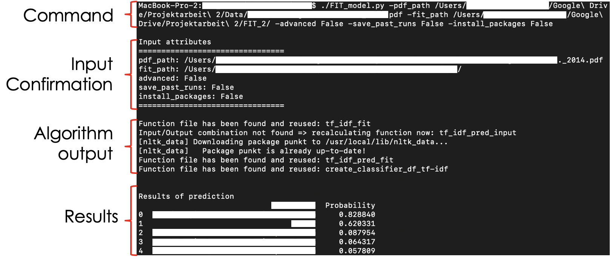
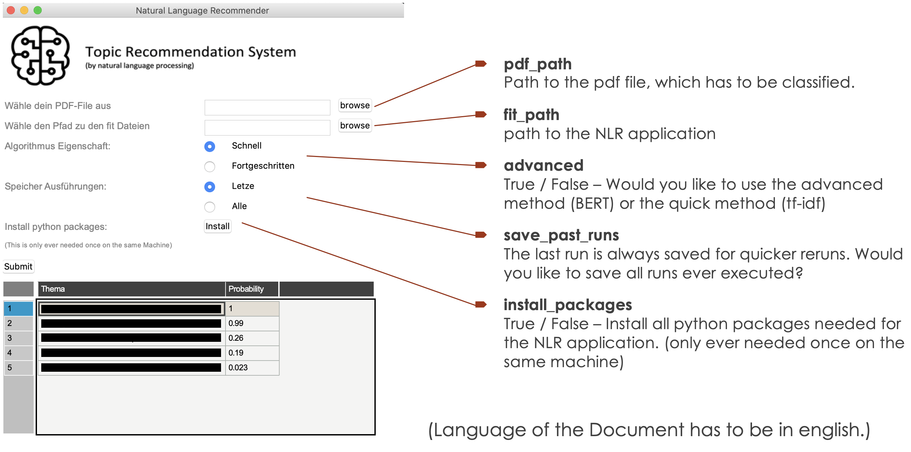
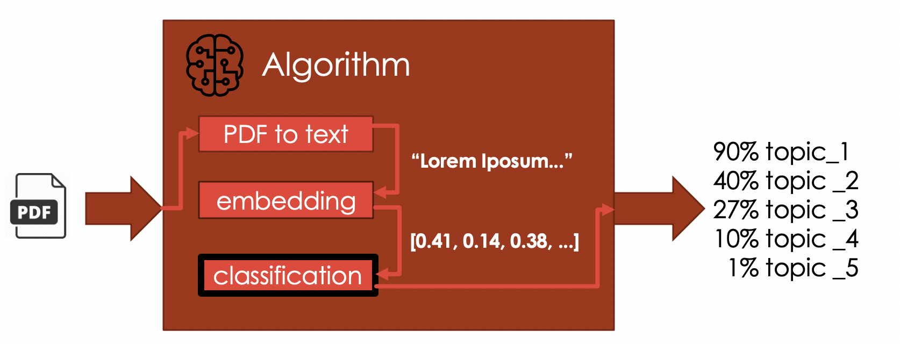
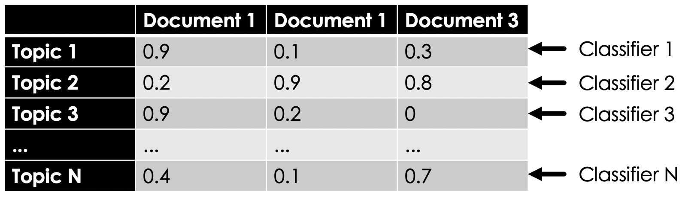
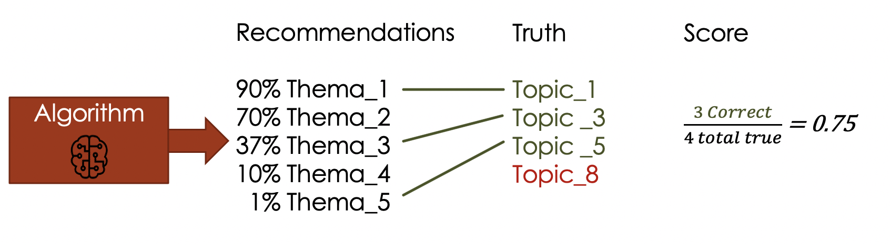

# Medirec

NLR is a Natural language Recommender which takes pdf-files as input for training and predicts the top 5 most probable medical labels for the target pdf-file.

# Problem

  - Manually labelling pdf-files can take a very long time
  - Expert knowledge in the field of the pdf-files is required to add proper labelling

# Goal

  - Train an automated recommender system on text data.
  - Algorithm returns recommendation for labels on a new pdf-file based on learned patterns.
  - Solution has to be easy to use

# Usage
There are two ways to use this system in production
### Command Line
The recommender can be used from the command line:
```bash
./FIT_model.py
-pdf_path /path/to/pdf/file.pdf
-fit_path /path/to/SVR/application/folder
-advanced False
-save_past_runs False
-install_packages False
```
When executing the command you will see this output in your console.

### GUI
There is a tkinter GUI which enables users to interact with the application in a user friendly way.

The GUI can be opened by calling the file `./Tkinter.py`




# Algorithm
1. The algorithm takes in pdf-files as input. The pdf-files are convertet to text which then gets cleaned for NLP usage.
2. The embedding creates a vector space from the text data.  
3. Embeddings will be trained against the training data in text_data.csv. After the training is done the algorithm will output the top 5 categories assigned to the input pdf.



## Embeddings
I have implemented two default Embeddings
  * tf-idf (fast)
  * BERT (advanced)

The code contains as well the function for Word2Vec but it is not used in the application.

## Binary Classification
For classification we compare a variety of classifiers.

Simple classifiers
* Nearest Neighbors
* RBF SVM
* Decision Tree
* Random Forest
* Neural Net
* AdaBoost
* Naive Bayes
* Dummy Classifier  

Ensemble classifiers
* Voting_Classifier_hard
* Stacking_Classifier

Since one document can have multiple Topics we create a prediction for every document-topic combination.


The output data will have following shape. Each row will be calculated by a different classifier and each data point is a different execution with different input.


The the best classifier is selected by comparing the weighted f-1 score across the prediction scores of each topic.

This final classifier is further used to classify the input pdf.

## Score
The overall score of the application is calculated following this logic:



The score bar chart can only be printed out when executing the python script.

# Data

### Input pdf
The input pdf can always be entered the same way, by choosing the correct path to the files.

### tf-idf Training Data
tf-idf training text has to be entered in the ./data/ folder in a .csv format.
The csv needs to contain following columns:
1. "ID" - unique ID for every document
2. "Thema" - Topic which will be used as tag
3. "Text" - String which will be used for training of the tf-idf algorithm

### BERT Training Data
BERT takes a very long time to create embeddings for texts. Therefore, I advice to precalculate the BERT embeddings.

The Algorithm uses a .csv file in the ./data/ folder with following structure:
1. "ID" - unique ID for every document
2. "Thema" - Topic which will be used as tag
3. "bert_*" - enter a new column for every bert dimension ("bert_1","bert_2",...)
